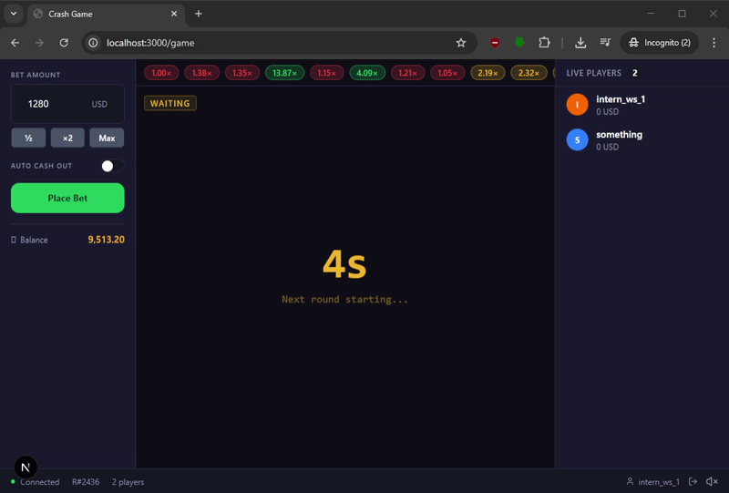

# 💥 Crash Game — Frontend

A real-time multiplayer crash game built with **Next.js**, **Zustand**, **TanStack Query**, and **Socket.IO**. Players place bets before the round starts and cash out before the multiplier crashes.

---

## Demo



---

## Features

- 🎰 **Live crash chart** — smooth real-time multiplier animation
- 💸 **Bet system** — manual cashout and auto-cashout support
- 👥 **Live players list** — synced through WebSocket events
- 📜 **Recent rounds history** — latest 20 rounds with multiplier highlights
- 🔊 **Audio effects** — round start, crash, and cashout sounds
- 📱 **Responsive UI** — optimized for desktop and mobile
- 🔌 **Realtime communication** — Socket.IO integration
- ⚡ **Persistent game state** — Zustand-powered client store

---

## Tech Stack

| Layer        | Library              |
| ------------ | -------------------- |
| Framework    | Next.js (App Router) |
| State        | Zustand              |
| Server State | TanStack Query       |
| Styling      | Tailwind CSS         |
| WebSocket    | socket.io-client     |
| Audio        | Howler.js            |
| Icons        | lucide-react         |

## Getting Started

### 1. Install dependencies

```bash
npm install
```

### 2. Run development server

```bash
npm run dev
```

Application will be available at:

```txt
http://localhost:3000
```

---

## Production Build

```bash
npm run build
npm start
```

---

## Backend API

Base URL:

```txt
https://crash-be-stas.fly.dev
```

### REST Endpoints

| Method | Endpoint             | Description                 |
| ------ | -------------------- | --------------------------- |
| `POST` | `/api/auth/login`    | Authenticate player         |
| `GET`  | `/api/balance`       | Get current player balance  |
| `GET`  | `/api/rounds/recent` | Fetch recent rounds history |
| `POST` | `/api/bets/place`    | Place a bet                 |
| `POST` | `/api/bets/cashout`  | Cash out active bet         |

---

## WebSocket Events

Socket server:

```txt
https://crash-be-stas.fly.dev
```

| Event            | Description             |
| ---------------- | ----------------------- |
| `round:waiting`  | Betting phase started   |
| `round:started`  | Round started           |
| `round:tick`     | Multiplier updated      |
| `round:crashed`  | Round crashed           |
| `players:update` | Players list updated    |
| `bet:placed`     | Bet placed successfully |
| `bet:cashedOut`  | Bet cashed out          |
| `bet:lost`       | Bet lost after crash    |

---

## Game Rules

- Minimum username length: `3`
- Minimum bet amount: `1`
- Starting balance: `10,000`
- Minimum auto-cashout: `1.01x`
- Auto-cashout step: `0.01`
- Recent rounds stored: `20`

---

## Project Structure

```txt
src/
├── app/
│   ├── game/
│   ├── globals.css
│   ├── layout.tsx
│   ├── page.tsx
│   └── providers.tsx
│
├── components/
│   ├── GameLayout.tsx
│   └── LoginForm.tsx
│
├── shared/
│   ├── api/
│   │   ├── audioService.ts
│   │   ├── httpClient.ts
│   │   └── socketService.ts
│   │
│   ├── constants/
│   │   ├── appConstants.ts
│   │   └── socketEvents.ts
│   │
│   ├── hooks/
│   │   ├── useBalance.ts
│   │   ├── useGameSocket.ts
│   │   ├── useInitApp.ts
│   │   └── useRecentRounds.ts
│   │
│   ├── lib/
│   │   ├── avatarUtils.ts
│   │   ├── cn.ts
│   │   └── storage.ts
│   │
│   ├── types/
│   │   ├── audioTypes.ts
│   │   ├── gameTypes.ts
│   │   ├── playerTypes.ts
│   │   └── socketTypes.ts
│   │
│   ├── ui/
│   │   ├── Button.tsx
│   │   ├── Input.tsx
│   │   ├── QuickBetMultipliers.tsx
│   │   └── Toggle.tsx
│   │
│   └── utils/
│       ├── clampAutoCashOut.ts
│       ├── clampBet.ts
│       ├── formatBalance.ts
│       └── getBetButtonState.ts
│
├── store/
│   ├── audioStore.ts
│   ├── betStore.ts
│   └── gameStore.ts
│
└── widgets/
    ├── BetPanel/
    ├── CrashChart/
    ├── HistoryBar/
    ├── PlayersPanel/
    └── StatusBar/
```

---

## Environment Variables

At the moment, backend URLs are hardcoded through `APP_CONSTANTS`.

```env
SOCKET_URL=https://crash-be-stas.fly.dev
API_BASE_URL=https://crash-be-stas.fly.dev
```

---

## Scripts

```bash
npm run dev      # Start development server
npm run build    # Production build
npm run start    # Run production server
npm run lint     # ESLint
```

---

## License

MIT
